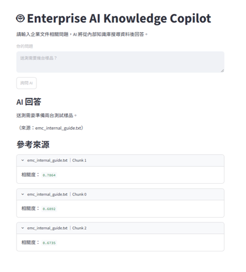

# 🤖 Enterprise AI Knowledge Copilot

> **Enterprise RAG Portfolio Project**  
> 使用 FastAPI、Gemini、Qdrant 與 Streamlit 建立的企業文件智慧問答系統。

本專案實作一套完整的 **Retrieval-Augmented Generation（RAG）** 流程，讓使用者可以直接以自然語言詢問企業文件內容。

系統會先透過 **Embedding + Vector Search** 找出相關文件片段，再將檢索內容交給 LLM 產生回答，並同時提供來源文件、Chunk ID 與語意相似度。

> ⚠️ 本專案為 Portfolio / Proof of Concept，所有企業文件均為自行建立的 Mock Data，不包含任何真實公司機密或客戶資料。

---

## 🖥️ Demo



### Example Question

> 送測需要幾台樣品？

### Example Answer

> 根據文件，一般示範流程需要準備兩台測試樣品。

系統同時顯示：

- 📄 Source Document
- 🧩 Chunk ID
- 📊 Semantic Similarity
- 💬 Generated Answer

---

## 🎯 Business Problem

企業內部通常累積大量知識文件，例如：

- SOP
- 技術文件
- 操作手冊
- FAQ
- 教育訓練資料
- 測試規範
- 流程文件

但實際使用時常遇到：

- 不知道文件放在哪裡
- 不知道正確搜尋關鍵字
- 相同概念可能有不同說法
- 新人高度依賴資深同仁
- 傳統關鍵字搜尋無法理解語意

因此本專案嘗試建立一個：

> **Enterprise AI Knowledge Copilot**

讓使用者可以直接使用自然語言詢問企業知識。

---

## ✨ Key Features

- 🔎 Semantic Search
- 🧠 Gemini Embedding
- 🗄️ Qdrant Vector Database
- 📚 Top-K Retrieval
- 💬 Gemini LLM Answer Generation
- 📎 Source Citation
- 🧩 Chunk ID Traceability
- 📊 Similarity Score Display
- 🌐 FastAPI REST API
- 🖥️ Streamlit Web UI
- 🔁 API Retry Handling
- ❤️ Backend Health Check
- 🧪 RAG Evaluation Dataset
- 🚫 Answerable / Unanswerable Tests
- 🐞 Failure Case Analysis

---

# 🏗️ System Architecture

```text
                     User
                       │
                       ▼
                Streamlit Web UI
                       │
                  HTTP / JSON
                       │
                       ▼
                    FastAPI
                       │
                       ▼
                Query Embedding
                       │
                       ▼
              Qdrant Vector DB
                       │
                Semantic Search
                       │
                       ▼
                 Top-K Chunks
                       │
                       ▼
                Context Builder
                       │
                       ▼
                  Gemini LLM
                       │
                       ▼
              Answer + Sources
                       │
                       ▼
                Streamlit Web UI
```

---

# 🔄 RAG Pipeline

## 1️⃣ Indexing Pipeline

企業文件進入系統後，依序進行：

```text
Document
   │
   ▼
Chunking
   │
   ▼
Embedding
   │
   ▼
Vector + Metadata
   │
   ▼
Qdrant
```

### Chunking

長文件不直接整份交給 LLM，而是先切成較小的文件片段。

每個 Chunk 保留：

```json
{
  "chunk_id": 2,
  "source": "emc_internal_guide.txt",
  "start": 280,
  "end": 460,
  "text": "如果送測資料不完整..."
}
```

同時使用 **Overlap**，降低重要資訊剛好被切斷的問題。

---

## 2️⃣ Embedding

每個 Chunk 透過 Embedding Model 轉換為向量。

```text
文字
 │
 ▼
Embedding Model
 │
 ▼
[0.0123, -0.0432, 0.0811, ...]
```

本專案使用：

> **768-dimensional vectors**

Embedding 的目的不是產生回答，而是讓系統可以比較：

> 「兩段文字在語意上有多接近？」

---

## 3️⃣ Vector Database

Embedding Vector 與 Metadata 儲存在 **Qdrant**。

每一筆資料概念上包含：

```text
Point
├── ID
├── Vector
└── Payload
```

例如：

```json
{
  "chunk_id": 2,
  "source": "emc_internal_guide.txt",
  "text": "如果送測資料不完整..."
}
```

本專案使用 **Cosine Similarity** 進行向量相似度搜尋。

---

## 4️⃣ Query Pipeline

當使用者輸入：

> 送測需要幾台樣品？

系統執行：

```text
Question
   │
   ▼
Query Embedding
   │
   ▼
Qdrant Vector Search
   │
   ▼
Top-K Relevant Chunks
   │
   ▼
Context Builder
   │
   ▼
Gemini LLM
   │
   ▼
Grounded Answer
```

因此 LLM 並不是單純依賴模型本身的知識回答，而是優先依據企業文件內容產生答案。

---

# 🧰 Tech Stack

| Category | Technologies |
|---|---|
| **Language** | Python |
| **Backend** | FastAPI, Uvicorn |
| **LLM** | Gemini API |
| **Embedding** | Gemini Embedding |
| **RAG** | Chunking, Embedding, Semantic Retrieval, Top-K Search, Context Injection |
| **Vector Database** | Qdrant |
| **Frontend** | Streamlit |
| **API / Communication** | REST API, HTTP, JSON |
| **Evaluation** | Python, JSON Dataset, CSV Export, Hit@K |
| **Reliability** | Retry Handling, HTTP Error Handling, Health Check |

---

# 📁 Project Structure

```text
enterprise-ai-knowledge-copilot
│
├── backend
│   └── main.py
│
├── frontend
│   └── ui.py
│
├── documents
│   └── emc_internal_guide.txt
│
├── scripts
│   ├── chunk_demo.py
│   ├── embed_chunks.py
│   ├── qdrant_setup.py
│   └── upload_chunks.py
│
├── evaluation
│   ├── eval_dataset.json
│   ├── evaluate_retrieval.py
│   └── retrieval_results.csv
│
├── screenshots
│   └── demo.png
│
├── README.md
├── requirements.txt
└── .gitignore
```

---

# 🚀 Getting Started

## 1. Clone Repository

```bash
git clone <YOUR_REPOSITORY_URL>
cd enterprise-ai-knowledge-copilot
```

---

## 2. Create Virtual Environment

```bash
python -m venv .venv
```

Windows PowerShell：

```powershell
.\.venv\Scripts\Activate.ps1
```

---

## 3. Install Dependencies

```bash
pip install -r requirements.txt
```

---

## 4. Configure Gemini API Key

請建立環境變數：

```text
GEMINI_API_KEY
```

Windows PowerShell 可以使用：

```powershell
setx GEMINI_API_KEY "YOUR_API_KEY"
```

設定完成後重新開啟 Terminal。

> ⚠️ 請勿將 API Key 寫入 Source Code 或上傳 GitHub。

---

## 5. Run Backend

```bash
python -m uvicorn backend.main:app --reload
```

Backend：

```text
http://127.0.0.1:8000
```

Swagger：

```text
http://127.0.0.1:8000/docs
```

---

## 6. Run Frontend

開啟另一個 Terminal：

```bash
python -m streamlit run frontend/ui.py
```

Frontend：

```text
http://localhost:8501
```

---

# 🔌 REST API

主要 Endpoint：

```text
POST /ask-rag
```

### Request

```json
{
  "question": "送測需要幾台樣品？"
}
```

### Response

```json
{
  "success": true,
  "question": "送測需要幾台樣品？",
  "answer": "送測需要準備兩台測試樣品。",
  "sources": [
    {
      "source": "emc_internal_guide.txt",
      "chunk_id": 1,
      "score": 0.7864
    }
  ]
}
```

> `score` 代表 **Vector Semantic Similarity**，不是答案正確率或置信機率。

---

# 🧪 RAG Evaluation

為避免只靠：

> 「看起來好像有回答對」

判斷系統品質，本專案另外建立 Evaluation Dataset。

測試資料分成：

### ✅ Answerable Questions

例如：

```text
送測需要幾台樣品？
```

```text
如果資料沒有準備完整應該怎麼處理？
```

```text
EMC 是什麼？
```

### ❌ Unanswerable Questions

例如：

```text
EMC 測試費用是多少？
```

```text
公司負責人是誰？
```

```text
今天晚上吃什麼？
```

---

## Evaluation Metrics

目前評估：

| Metric | Purpose |
|---|---|
| **Top-1 Similarity Score** | 觀察最高相關文件分數 |
| **Retrieved Chunk IDs** | 確認實際取回哪些文件 |
| **Hit@3** | 正確 Chunk 是否出現在前三名 |
| **Answerable Test** | 文件是否真的具有答案 |
| **False Positive** | 文件沒答案，但系統判斷可以回答 |
| **False Negative** | 文件有答案，但系統拒絕回答 |

Evaluation Result：

```text
Hit@3 = <請填入你的實際結果>
```

測試結果會輸出：

```text
evaluation/retrieval_results.csv
```

方便後續使用 Excel 或 Python 進一步分析。

---

# 🐞 Known Failure Case

本專案 Evaluation 過程發現一個重要 Failure Case。

### Query

```text
公司負責人是誰？
```

Mock 文件中並沒有公司負責人的資料。

因此 Ground Truth 為：

```text
Answerable = False
```

但 Vector Retrieval 得到：

```text
Top Similarity Score ≈ 0.6117
```

如果單純設定：

```python
SCORE_THRESHOLD = 0.60
```

系統就會判斷：

```text
Predicted Answerable = True
```

因此形成：

> ❌ **False Positive**

---

# 💡 Lesson Learned

這個案例顯示：

> **Vector Similarity ≠ Answer Correctness Probability**

例如：

```text
Similarity = 0.61
```

並不表示：

```text
答案有 61% 機率正確
```

它只表示：

> Query 與某個 Document Chunk 在 Embedding Space 中具有一定語意相似度。

因此正式企業 RAG 系統不能單純依賴固定 Similarity Threshold 判斷是否回答。

未來可以加入：

- Reranker
- Answerability Detection
- Query Classification
- Metadata Filter
- Larger Evaluation Dataset
- Human Feedback
- LLM-as-a-Judge

---

# 🧪 Negative Test Example

另一個測試問題：

```text
今天晚上吃什麼？
```

實測：

```text
Top Score ≈ 0.5862

Ground Truth = False

Predicted = False
```

此案例成功判斷為：

> 文件無法回答。

這也說明不同 Negative Query 仍可能得到不同 Similarity Score，因此 Threshold 應根據 Evaluation Dataset 調整，而不是憑感覺設定。

---

# 🛡️ Reliability

AI API 不一定永遠穩定。

開發過程曾實際遇到：

```text
503 UNAVAILABLE
```

原因：

```text
High Demand
```

因此 Backend 加入 Retry Handling：

```text
API Request
    │
    ▼
Gemini 503
    │
    ▼
Wait
    │
    ▼
Retry
    │
    ▼
Retry
    │
    ▼
Success / Return 503
```

若多次 Retry 後仍然失敗：

```text
HTTP 503
```

並提供較友善的錯誤訊息：

> Gemini 目前服務繁忙，請稍後再試。

---

# 🌐 HTTP & Validation Handling

開發過程實際處理過：

| Status | Meaning |
|---|---|
| **200 OK** | Request 成功 |
| **422 Unprocessable Content** | JSON / Request 格式錯誤 |
| **500 Internal Server Error** | Backend 發生例外 |
| **503 Service Unavailable** | 外部 AI Service 暫時不可用 |

---

# 🖥️ Frontend / Backend Separation

Frontend：

```text
Streamlit
```

Backend：

```text
FastAPI
```

兩者透過 REST API 溝通：

```text
Streamlit
    │
    │ POST /ask-rag
    ▼
FastAPI
    │
    ▼
RAG Pipeline
```

未來 Frontend 可以替換成：

- React
- Vue
- Next.js
- Mobile App
- LINE Bot
- ERP
- n8n Workflow

而不需要重新設計核心 RAG Backend。

---

# 🔐 Data Privacy

本 Portfolio Project 僅使用：

> **Synthetic / Mock Data**

不包含：

- 真實企業 SOP
- 真實客戶資料
- 報價資料
- 個人資料
- 公司機密
- 內部帳務資料

實際企業部署時，應進一步評估：

- Sensitive Data Classification
- API Provider Data Policy
- Data Retention
- Authentication
- Authorization
- RBAC
- Audit Log
- Encryption
- Internal AI Governance

PoC 階段應優先使用：

> Mock Data 或 De-identified Data

避免將敏感企業資料直接提供給外部 AI Service。

---

# 🧭 Development Journey

本專案採用 Incremental Development。

```text
Day 1
Gemini API
    ↓
Day 2
Interactive CLI
    ↓
Day 3
FastAPI
    ↓
Day 4
Document Grounding
    ↓
Day 5
Chunking
    ↓
Day 6
Embedding
    ↓
Day 7
Qdrant
    ↓
Day 8
Semantic Retrieval
    ↓
Day 9
Full RAG Pipeline
    ↓
Day 10
RAG Evaluation
    ↓
Day 11
Streamlit Web UI
    ↓
Day 12
Portfolio Packaging
```

開發循環：

```text
Build
 ↓
Run
 ↓
Error
 ↓
Debug
 ↓
Fix
 ↓
Evaluate
 ↓
Improve
```

---

# 📚 What I Learned

透過本專案實際操作：

### AI / RAG

- LLM API Integration
- Chunking
- Embedding
- Vector Database
- Semantic Search
- Cosine Similarity
- Top-K Retrieval
- RAG
- Grounding
- Hallucination Risk

### Backend

- FastAPI
- REST API
- HTTP
- JSON Validation
- Status Codes
- Error Handling
- Retry Mechanism

### Evaluation

- Ground Truth
- Hit@K
- Answerable / Unanswerable Testing
- False Positive
- False Negative
- Failure Case Analysis

### Frontend

- Streamlit
- API Integration
- Backend Health Check
- Frontend / Backend Separation

---

# 🚧 Future Improvements

## RAG Quality

- Better Chunking Strategy
- Dynamic Chunk Size
- Reranker
- Hybrid Search
- Keyword + Vector Search
- Metadata Filtering
- Query Rewriting
- Answerability Detection

## Document Processing

- PDF Upload
- DOCX Upload
- Excel Support
- OCR
- Automatic Document Indexing

## Evaluation

- Larger Evaluation Dataset
- Precision@K
- Recall@K
- MRR
- LLM-as-a-Judge
- Human Evaluation
- Regression Testing

## Enterprise Features

- Authentication
- RBAC
- Department Permissions
- Query Logging
- Audit Log
- Feedback 👍 / 👎
- Monitoring
- Cost Tracking

## Deployment

- Docker
- Qdrant Server
- Cloud Deployment
- Azure AI Integration
- CI/CD

---

# 🎓 Project Takeaway

這個專案最大的學習不是：

> 「成功呼叫一次 LLM API。」

而是理解：

> **能 Demo 的 AI 系統，不等於可靠的企業 AI 系統。**

真正的企業 AI 應用還需要考慮：

```text
Retrieval Quality
        +
Evaluation
        +
Reliability
        +
Security
        +
Data Governance
        +
User Experience
        +
Monitoring
```

因此本專案除了建立完整 RAG Pipeline，也保留並分析 Failure Cases，作為後續系統改善的依據。

---

# 👤 Author

**AI Application Engineering Portfolio Project**

Focus Areas:

- Enterprise AI
- RAG
- LLM Integration
- Workflow Automation
- AI Application Engineering

---

# 📄 Disclaimer

This project is a **portfolio proof-of-concept**.

All enterprise documents used in this repository are synthetic / mock data created for demonstration and educational purposes.

**No confidential company data or customer information is included.**